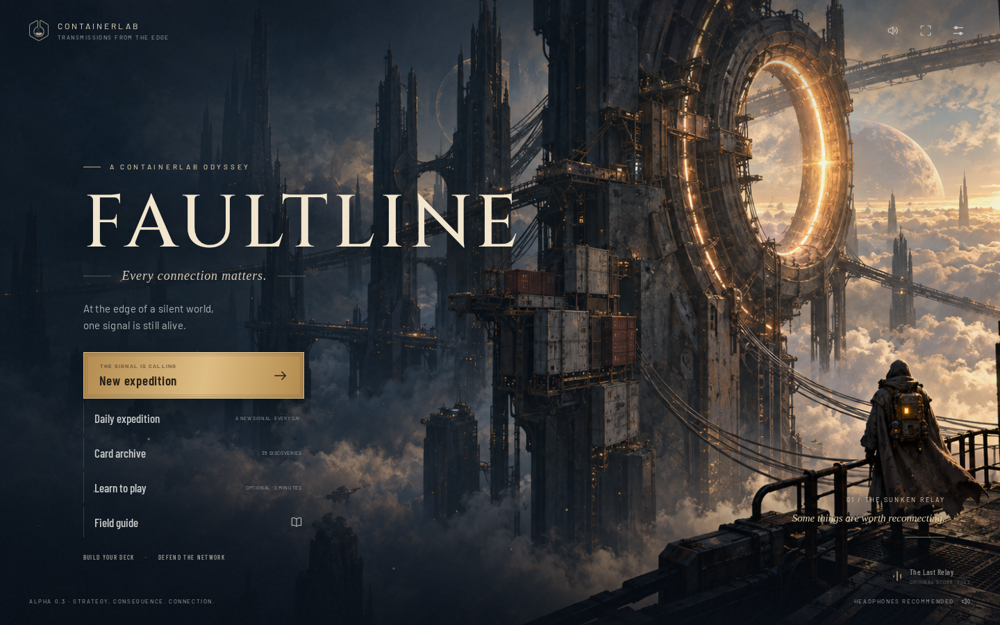
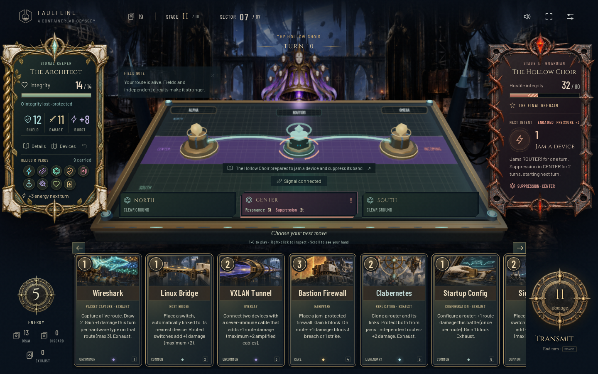

# FAULTLINE

**A Containerlab odyssey. Every connection matters.**

A desktop deckbuilding roguelike set in a ruined orbital relay. Build a living network on a 3D table with three energy a turn: every independent channel adds bandwidth to the transmission you send at your target, every device works while it is reachable, and the quarantine comes in packs, builds on your table and grows with every action it takes. Carry a twelve-card deck through a branching expedition to the Blackout Core and grow it into one of nine builds.

**[Play in your browser](https://flosch62.github.io/faultline/)** · [Contributing](CONTRIBUTING.md) · [MIT license](LICENSE)

An independent open-source fan game in the Containerlab universe. **Playable alpha 0.3**, focused on laptop and desktop.



## Play locally

Use Node.js 24 and npm:

```sh
npm ci
npm run dev
```

Open **http://localhost:5174**. Music starts after the first interaction. Headphones recommended.

```sh
npm run build       # Type checking and production build in dist/
npm run preview     # Serve the production build
npm test            # Deterministic game rules, cards, lessons and the Handbook
npm run balance -- 500 # Reproducible seeded balance probe
npm run tables -- --write # Regenerate the design document's card and rule tables
npx playwright install chromium
npm run test:e2e    # Actual browser gameplay, desktop layout and audio playback
npm run test:smoke  # A quick @smoke subset of the browser suite
npm run models      # Rebuild the device, installation and prop models from blender/ (needs Blender 4.2+)
```

Playing requires no API keys, GPU music model, Containerlab daemon, or external asset service. All artwork, device models, fonts and playable music are bundled. Hardware-accelerated WebGL is recommended. Desktop is the primary target. The game defaults to 110% interface scale while browser zoom stays at 100%; compact windows scroll instead of cropping essential controls.

## Inside the game

- **The network is your army.** Every live ALPHA → router → OMEGA route counts. Every device carries one **channel**: when two routes go through the same device, they are one channel, not two. Every channel beyond the first adds bandwidth; the ledger reads "4 routes · 3 channels", each channel glows in its own colour on the table and a brass seal marks a device where routes merge. Devices work while they are **online** on any live route: firewalls block from any branch, stack and quarantine hostile installations beside them, Cache Servers draw, PoE Injectors add energy, Load Balancers multiply bandwidth, and a cabled **Honeypot** lures jams, cuts and overloads and bites back. A cut cable takes everything behind it offline, so redundancy protects your engine.
- **Packs and ports.** Up to three hostiles hold the far rail: a leader and its escorts, a swarm duo, or a guardian raising adds. Every hostile stands whole on the far rail with one plate under its portrait: its next action (STRIKE 7, JAM ROUTER1, PLANT JAMMER, RESTS), its name and its health with the forecast loss; a click on a hostile makes it your **target**. Every channel is a **delivery**, and every delivery lands on the target: they merge into one packet, armor is paid once, and damage beyond the target's health **overflows** to the next hostile. The plate beside the rail adds it up, each channel in its colour, and names the overflow. Escorts act on alternate phases and couple to their leader (twin cuts, uplinks, plating links, a last echo), so kill order is a decision. Against a single hostile nothing changes.
- **The table front.** Hostiles plant **installations** on your table: Siphon Taps, Jammers beside your router, Spikes that wear devices down, Anchors that pin a field, Breaker Charges that count down in plain sight. Devices have **condition** and can break for the encounter, leaving wreckage. Scrub, repair, Purge Field, firewall quarantine, honeypot bites, Server Racks and Phantom Nodes answer; every destroyed installation returns shield (Reclaim).
- **Escalation.** A leader's disruption grows in three visible levels (longer jams and frayed cables, double faults, planted installations), sooner in the last stage. Guardians charge on their fifth action or as soon as they are wounded, and raise two adds that each raise the break threshold while they live.
- **Designations and surprises.** Ten one-line designations (Nesting, Armored, Stoked, Shedding, Hardened, Rigged, Hungry, Spiteful, Laden, Salvaged) vary the leaders; some hide behind interference until the entrance. Reinforcements are announced actions ahead, escorts carry sealed crates (salvage, credits, a card for the encounter), Laden hostiles drop undelivered messages with named choices, and rare signals are named a turn before they fire. Nothing is rolled against you after the forecast.
- **Three energy, five cards.** Every turn is a budget in the Slay the Spire mould: a router and two cables cost three, a whole turn, and a daemon trades this turn's tempo for every turn after it. Energy relics raise the turn's base to at most five; PoE Injectors, next-turn energy and Power Surge come on top, uncapped. The energy orb reads what is left over the base (2/3) and glows when you rise above it.
- **Three keepers, nine build paths.** Each keeper starts with twelve cards and has its own 23-card set. The Architect goes wide with Hot Swap and the **Patch Cable** console: **Mesh** (channels and width), **Backbone** (one long, upgraded route) or **Deployment** (hardware tempo and device triggers). The Warden fortifies with **Harden** and **Backpressure**, shield that stops damage turning into damage: **Fortress**, **Firewall wall** or **Protocols**. The Ghost **buffers** a transmission and releases it in one targeted spike, unless a cut or a breakdown leaves no live route and the packets are lost: **Buffer**, **Evasion** or **Payloads**, a swarm of Payload tokens. A shared colorless pool feeds every path.
- **Keywords and Daemons.** Exhaust, Retain, Innate, Volatile and Armed explain themselves in a glossary tooltip on every card. A **Daemon** is paid once and runs for the rest of the encounter as a seal on your player plate: Keepalive, Fabric Controller, Persistent State, Deep Queue, Botnet and fifteen more. Copies stack.
- **Curses are a price.** Six curses (CVE, Zombie Process, Kernel Panic, Backdoor, Bitrot, Memory Leak) arrive from ascension, the Overvolt boss relic and event deals that name them up front: a free rare for a Backdoor, three upgrades for a Bitrot. Sanctuaries and markets remove them at any deck size.
- **Protocols** arm face down and fire on the enemy's matching action: Failover Policy, Port Security, Rate Limiter, IPS Signature, Quarantine Rule, Tarpit, and the Warden's Tripwire and Null Route. Every forecast shows which will trigger.
- **Bands matter.** Crowd three online devices into one band for a cluster, or split routers North and South for separated-circuit shield. Fields, corrosion, suppression, band jams, installations and their reach rings make you decide where to build. Every battle starts on its own terrain: wreckage, salvage hardware, crystal veins or interference.
- Three seven-sector stages with seeded route maps that scout packs and designations, **20 hostiles, 7 escorts and 3 guardian adds**, elites, sanctuaries, a **market**, **Unknown-signal events** and three guardians: the Iron Regent, the Hollow Choir and the Blackout Core, with charge turns announcing **Crownfall, Requiem and Total Blackout**. Deal the break threshold on the ultimate turn to interrupt and expose them, or brace.
- Enemies ask questions with more than one answer: graded armor that falls with every extra channel, plating that an online firewall ignores, Lockdown jams that hunt firewalls, overloads that wear devices, installations to scrub or quarantine, junk cards and a Spiteful action that resolves even at lethal.
- **137 cards** (60 colorless, 23 per keeper, 6 curses and 2 junk), **129 with an upgraded `+` version**, and **32 relics** including eleven **boss relics** that bend the rules at a price, six of them energy relics. Rewards roll your keeper's pool or the colorless one, mostly commons after a normal fight, uncommons and rares after a guardian. Credits buy cards, relics, removals and upgrades; sanctuaries repair, upgrade, remove or salvage; thirteen events trade integrity, credits, cards and curses.
- **Ascension 0–4** per keeper, unlocked by winning: Hardened Quarantine, Lean Supply, Sharper Teeth and The Last Signal.
- Exact, pure forecasts: every delivery, per-port packet, damage, shield, trap, installation effect, wear point and arrival is listed before you commit, and resolution uses the same numbers.
- **Field Training**: 14 short interactive lessons in 12 chapters, played at three energy like an expedition (routes, reading intents, rerouting, online devices, zones, traps, each console, danger and guardians, the expedition, and three hard-railed drills: a three-hostile pack taught one idea at a time, from reading each port's next move to choosing the target, overflow and kill order; clearing the table front; and breaking a guardian through its adds) plus an illustrated **Handbook** of 17 chapters, including where energy comes from, Keywords & Daemons, the nine build paths, Cards & Curses, Packs & Ports, The Table Front and a Danger Playbook. A finished lesson ends: its board freezes and a completion plate offers the next lesson, a replay from a fresh board or the training menu. Lessons never touch your expedition, and a new player's first New expedition recommends them.
- Larger, more threatening painted hostiles with anticipation, lunges, embers and guardian presence, and painted escorts, adds and new leaders; distinct device models, including the Server Rack, the Phantom Node and the Sentry Firewall's searchlight; modelled installations, crates and message fragments; every channel in its own colour (gold primary, then cyan, green, blue, …), its packets flying to the target when you transmit, amplified cables wound with violet fibre, brass junction seals where routes merge, and a hover card for every device, cable and installation; offline, worn, salvage and wreckage states on the table.
- **58 material sound cues with 98 stereo masters** from six CC0 Kenney packs, loudness-matched: card Foley, metal, glass, signal and layered combat impacts, each tied to one game moment. **Nine original instrumental tracks.**
- Local autosave (version 5; earlier expeditions are not continued), local run records, undo, card inspection, keyboard play and reduced motion.
- A Containerlab topology exporter. Combat is a browser simulation; exported labs need suitable images and real device configuration before they can route traffic.

Read the [complete implemented game design](docs/game-design.md), [story and world](docs/narrative.md) and the [v5 balance probe](docs/balance-v5.json); the [v4 probe](docs/balance-v4.json) and the [v3 baseline](docs/balance-v3.json) are kept as history. The v5 probe's tactical bots win 37 % (Architect), 42 % (Warden) and 39 % (Ghost) at ascension 0 over 300 seeds each, 21–25 % at ascension 2, and all nine build paths stay within 0.6–1.4 × their keeper's rate. Simulated win rates are regression probes; human playtesting remains necessary to tune difficulty and enjoyment.

### Discover the signature cards

| Card | Rarity | Energy | Effect |
| --- | --- | --- | --- |
| Containerlab | Rare | 3 | Deploy an overclocked router cabled to ALPHA and OMEGA: a fresh 7-damage route. Exhaust. |
| Clabernetes | Legendary | 2 | Clone a router with its cables and upgrades. Both become jam-protected; the new disjoint path is instant bandwidth. Exhaust. |

These are discoveries, **not starter cards**. Opening hands provide a router and two link cards so every deck can build its own route. Clabernetes has a lower individual reward chance than Containerlab. Startup Config, Linux Bridge, VXLAN Tunnel and Clab Inspect bring more of Containerlab's vocabulary into everyday builds.

**Wireshark** is an uncommon, one-energy packet capture. It draws two cards and adds one burst damage for each distinct device type on your primary route, with no cap: a router, switch, firewall and load balancer circuit earns four. The card exhausts for the encounter, and its journal entry shows exactly what it captured.

[See Wireshark's card and synergy explanation](docs/screenshots/wireshark.png).

## Controls

| Action | Control |
| --- | --- |
| Play a card | Click, or press 1–9; 0 selects the tenth card |
| Inspect a card | Right-click, press I on a focused/selected card, or select it in the archive |
| Place hardware | Click the table, drag its card, or use “Deploy in a free socket” |
| Connect devices | Play a link, then choose two devices on the table or in the target strip |
| Replicate / upgrade / shield | Play the card, then choose a valid device |
| Relocate hardware | Drag a placed device to a new socket, or select it and pick a band; a plate beside it asks first: Relocate (Enter) pays 1 energy, Cancel (Esc, right-click or a click elsewhere) puts it back. A drop in its own socket is free |
| Read a device, cable or installation | Rest the pointer on it: a card shows what it does now, its channel and what threatens it |
| Orbit the table | Drag empty table space |
| Apply a field | Play a field card, then click a band on the table or its field seal |
| Console command | Console control in the command dock, or C (Patch Cable then asks for two devices) |
| Arm a protocol | Play the protocol card; it waits face down and fires on the matching enemy action |
| Run a daemon | Play the daemon card; it becomes a seal on your player plate and runs for the encounter (right-click a seal to inspect it) |
| Target a hostile | Click it: its portrait, its plate or its port row (Tab to a port row, then Enter); F cycles the target. Every delivery lands on the target; what a kill does not need overflows to the next hostile. Free and undoable |
| Read a hostile | Hover its portrait, its plate or its port row: its forecast, designation, health after the transmission and the channels landing on it. Hover a channel on the plate's Transmission line for its terms and route |
| Repair a worn device | Click the device, then Repair; or R (the selected device, else the most worn); 1 energy per condition point |
| Scrub an installation | Click the installation, then Scrub; or S (the selected one, else the most dangerous); 1 energy per integrity point |
| Answer a message or crate | Click a choice, or press 1–3; it opens before your next hand |
| Delete a Worm | Play it for 1 energy before you transmit |
| Browse a large hand | Hand arrows or horizontal scrolling; 1–0 still selects any card |
| Transmit / end turn | Brass dial, Space or Enter; focused buttons retain normal keyboard behavior |
| Prepare / return a card | Prepare control or P; keep one card for next turn in place of one draw |
| Undo before transmitting | Z |
| Cancel selection / settings | Escape |

Faults last one player turn (an escalated jam two). Hot Patch clears every active fault at once and repairs your most worn device; a second channel keeps you transmitting through them. Energy returns to three (up to five with energy relics) plus reserves and online PoE Injectors, and five cards are drawn after each transmission (plus online Cache Servers); Retain cards stay in hand. Temporary shield and burst expire; hardware remains until the encounter ends. Exhausted cards return next encounter. Integrity, credits and your deck carry between sectors.

Fields belong to the ground: moving hardware changes which effects apply immediately. Each band holds one allied and one hostile field, plus any terrain or signal field; another allied field replaces yours, and a second hostile caster replaces the first. An Anchor stops its band's hostile fields from ticking down. Corrosion adds 2 incoming damage while any deployed hardware occupies its band. Suppression removes 3 damage when your primary route crosses its band. Fixed ALPHA/OMEGA terminals do not activate fields. Purge Field destroys every installation in the chosen band and removes hostile fields and device jams there (an Anchor takes the whole purge alone), preserves allied fields, draws one card and exhausts.

## Developer playground

Open `/dev/` to experiment on the real battlefield. With `npm run dev`, use
`http://localhost:5174/dev/`; a build hosted at `/faultline/` includes `/faultline/dev/`.
The playground has its own autosave and restart point. It never records wins or
unlocks ascensions in your normal expedition.

- **Scenarios:** ten editable channel examples, from one router to parallel paths,
  shared routers/firewalls, cross-links, unfinished routes, missing routers and cuts.
  A live diagram and independent-route proof explain what counts after every edit.
- **Build:** repeat cards with refilled energy, choose any card or upgrade, wire
  devices, remove hardware/cables, jam, cut, repair and undo edits. The normal table
  limits and channel rules still apply; turn Free cards & energy off to test costs.
- **Encounter:** jump to any stage, sector, room type, keeper and ascension. Use the
  seeded encounter or choose an enemy and escorts. Generated terrain is optional.
- **Cheats:** step a turn instantly, win or skip encounters, restore integrity,
  add resources, change enemy health/pattern position, toggle relics and enable
  immortality. Immortality restores integrity after damage resolves; the forecast
  still shows the real incoming damage.
- **Restart and share:** save a restart point, replay it, or export/import the whole
  setup as JSON. Loading a scenario or entering a room sets a new restart point.

The route-variant count groups paths visiting the same devices. Channel count is
still the maximum number of live router routes sharing no intermediate device.

## Project guide

- `src/core/` — deterministic rules: `rules.ts` (`RULES`), `cards/` (card data, one file per keeper, colorless and curses, faces generated from `values`), `effects/` (card effects and daemon hooks per owner), `cards.ts` (the merged `CARDS`, upgrades, starters, relics), `rewards.ts` (reward pools, rarities and market slots), `run.ts` (the public combat API and forecast), `combat/` (the one resolver behind forecast and resolution: board, network, intents and escalation, surprises), `graph.ts` (routes and channels), `terrain.ts`, `enemies.ts` (hostiles, escorts, adds, designations, pack templates, signals, message options), `encounter.ts` (pack plans, crates, reinforcements, messages), `meta.ts` (rooms, rewards, market, sanctuary), `events.ts`, `ascension.ts`, `map.ts`, `expedition.ts` (keepers, starter decks and save validation) and YAML export.
- `src/three/` — table, device, installation and prop models (`models.ts` loads the Blender bodies), the three-port rail and its plates (`plates.ts`), the table front (`front.ts`), terrain props, cables, painted enemies, lighting and packet animation; `src/battle-playback.ts` choreographs a transmission port by port.
- `blender/` — one Python script per model in three families (devices, installations, props) that builds its body in Blender and exports `public/models/`; see the [model contract](blender/README.md).
- `src/ui.ts`, `src/card-marks.ts`, `src/battle-ui.ts`, `src/alpha-ui.ts`, `src/screens.ts` and their stylesheets — illustrated cards (owner frames, keyword markers, modified costs), the battle HUD (energy orb, daemon seals, port strip, transmission breakdown, escalation gauge, repair and scrub plates), inspection, journals (Details, Devices, the message dialog) and every expedition screen.
- `src/tutorial.ts`, `src/tutorial/` — Field Training lessons and the illustrated Handbook.
- `src/dev/`, `dev/index.html` — the separate playground, setup operations and live channel inspector.
- `src/story.ts` — chapters, enemy motivations, sanctuary discoveries and endings.
- `src/main.ts` — input, view transitions, targeting, undo and autosave.
- `src/audio.ts`, `src/audio-effects.ts` — music playback, crossfades, sampled effects, voice priority and combat ducking. The CUE GUIDE in `audio-effects.ts` lists exactly when each of the 58 cues plays.
- `public/art/` — finished game artwork; [original art direction](docs/art-prompts.md) and [fieldcraft artwork prompts](docs/art-polish-prompts.md), and [expedition artwork prompts](docs/art-expedition-prompts.md). The v4 escort, leader and add sheets, the warning plate and the message and crate illustrations are recorded in `docs/art-v4-bodies-manifest.json`, `docs/art-v4-plates-manifest.json` and `docs/art-v4-illustrations-manifest.json` (the fourteen v4 cards in `docs/art-v3-manifest.json`); `uv run scripts/compose_sheet.py` cuts the painted bodies out of their backdrop and rebuilds any sheet from its manifest.
- `public/audio/` — fifteen instrumental Ogg masters, including exploration and combat themes for each stage, and the material effects bank.
- `soundtrack/` — one folder per song in `tracks/`, alongside `effects/` and `licenses/`. Scores, generation metadata and provenance are tracked; large recordings and intermediate arrays remain local and ignored by Git.
- [Soundtrack production](soundtrack/README.md) and [effects production](soundtrack/effects/README.md) — source material, licenses and reproduction steps.
- [Third-party notices](THIRD_PARTY_NOTICES.md).

## GitHub Pages

The [Checks and Pages workflow](.github/workflows/pages.yml) runs rule tests, builds the game for its repository path, plays the production build in Chromium, and publishes successful pushes to `main`. Pull requests run the same checks without deploying.

To preview the Pages build locally:

```sh
VITE_BASE_PATH=/faultline/ npm run build
VITE_BASE_PATH=/faultline/ FAULTLINE_TEST_BUILD=true npm run test:e2e
```

To publish a fork, enable GitHub Pages with **GitHub Actions** as the source, then run the workflow. Its base path follows the repository name.

## License and credits

Project code and project-created assets are available under the [MIT license](LICENSE), to the extent of the contributors' licensable rights. Bundled fonts, the Containerlab mark and third-party libraries retain their [original licenses](THIRD_PARTY_NOTICES.md). YuE2 model weights are not included; their separate license is preserved with the soundtrack provenance.

Artwork was created with OpenAI image generation and local Krea 2 Turbo. The soundtrack preserves the complete native YuE2 recordings, with fades and a constant volume adjustment for game playback. Prompts, score plans and production details are included.



The presentation fixture above displays all nine relics to exercise the crowded layout. [View the Copper Market](docs/screenshots/market.png) or [a guardian fight](docs/screenshots/guardian.png). These screenshots predate Under Quarantine: they show a single hostile at the centre port, without the port strip, deliveries or installations. The [validation notes](docs/polish-validation.md) record the tested sizes and balance scenarios. To reproduce the layout audit against the dev server: `FAULTLINE_ORIGIN=http://127.0.0.1:5174 node --experimental-strip-types scripts/audit-layout.mjs`.
